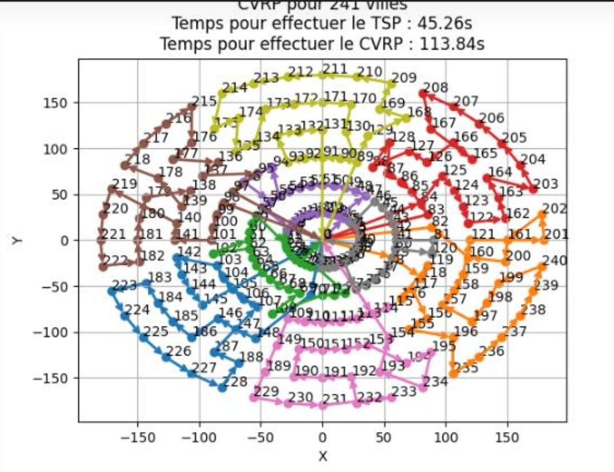

# CVRP

The Capacitated Vehicle Routing Problem (CVRP) is a classic optimization problem in logistics and supply chain management. The goal is to determine the most efficient set of routes for a fleet of vehicles to deliver goods to a set of customers, while respecting vehicle capacity constraints.

This problem has real-world applications in industries such as transportation, delivery services, and warehouse logistics. Solving the CVRP effectively can lead to significant cost savings, improved delivery times, and better resource utilization.



## Installation
You can run this example without installation in cloud-based IDEs that support the
[Development Containers specification](https://containers.dev/supporting) (aka "devcontainers")
such as GitHub Codespaces.

For development environments that do not support `devcontainers`, install requirements:

```bash
pip install -r requirements.txt
```

If you are cloning the repo to your local system, working in a
[virtual environment](https://docs.python.org/3/library/venv.html) is recommended.

## Usage
Your development environment should be configured to access the
[Leap&trade; quantum cloud service](https://docs.ocean.dwavesys.com/en/stable/overview/sapi.html).
You can see information about supported IDEs and authorizing access to your Leap account
[here](https://docs.dwavesys.com/docs/latest/doc_leap_dev_env.html).

### Customizing Problem Instances

You can modify the problem instances directly in the `CVRP_QuantumCode.py` file to either use pre-defined literature instances or generate your own custom instances. Below are the steps to configure the code for your desired use case:

#### **1. Using Literature Instances**
Literature instances are sourced from [this repository](http://vrp.galgos.inf.puc-rio.br/index.php/en/). To use these instances:
- Uncomment the relevant section under `# Single literature instance generation` or `# Multiple literature instance generation`.
- For a single instance:
  - Set the `path_to_file` variable to the directory containing the `.vrp` files.
  - Update `instance_name` with the name of the desired instance.
  - Example:
    ```python
    path_to_file = "/workspaces/QuantumOptimisation/E/"
    instance_name = "E-n22-k4"

    tuple_value = literatureGeneration(path_to_file, instance_name, path_to_png)
    ```
- For multiple instances:
  - Set the `path_to_file` variable to the directory containing multiple `.vrp` files.
  - The script will automatically iterate through all the files in the directory.
  - Example:
    ```python
    path_to_file = "/workspaces/QuantumOptimisation/M/"
    for f in os.listdir(path_to_file):
        if f[-3:] == "vrp":
            file = f[:-4]
            tuple_value = literatureGeneration(path_to_file, file, path_to_png)
    ```

#### **2. Generating Custom Instances**
If you want to generate custom problem instances, use the `selfgeneration` function. You can configure the parameters as follows:
- `numberOfVehicles`: Number of vehicles available.
- `numberOfCities`: Number of delivery points or cities.
- `capaConsumptionMin`: Minimum capacity consumption per city.
- `capaConsumptionMax`: Maximum capacity consumption per city.

Example:
```python
numberOfVehicles    = 3
numberOfCities      = 20
capaConsumptionMin  = 1
capaConsumptionMax  = 4
selfgeneration(numberOfVehicles, numberOfCities, capaConsumptionMin, capaConsumptionMax)
```

#### **3. Saving Results**
- **Single Instance**: After running the optimization for a single instance, the results will be saved in a `.csv` file named after the instance. For example, if the instance name is `E-n22-k4`, the file will be saved as `Result_E-n22-k4.csv`.
  - Example:
    ```python
    df.to_csv(f"Result_{instance_name}.csv", index=False, encoding='utf-8', sep=";")
    ```

- **Multiple Instances**: When running optimization for multiple instances, the results are combined into one CSV file called `Result_set_M.csv`. This file will contain all the results for the different instances in a single table.
  - Example:
    ```python
    df.to_csv("Result_set_M.csv", index=False, encoding='utf-8', sep=";")
    ```

You can customize the saving process by modifying the filename or adjusting how the data is organized before saving it.

### Resolving Problem Instances

Run the following terminal command to start the CVRP Optimisation:

```bash
python CVRP_QuantumCode.py
```

## Problem Description

**Objective**: To solve the Capacitated Vehicle Routing Problem (CVRP) by optimizing the routes for a fleet of vehicles while considering both the capacity of the vehicles and the demand of each location. The solution is divided into two parts: clustering and the Traveling Salesman Problem (TSP).

**Constraints**: 
1. Each vehicle can only visit a set of locations within its capacity.
2. The total demand of each cluster must not exceed the vehicle's capacity.
3. The goal is to minimize the total cost (distance or time) of visiting all locations.

## Model Overview

### Parameters
- **Vehicles**: A fleet of vehicles, each with a specific capacity to serve the locations.
- **Locations**: A set of locations that need to be visited by the vehicles, each with a demand and position.
- **Clustering**: The process of grouping locations into clusters such that the total demand of each cluster does not exceed the vehicle capacity.
- **Traveling Salesman Problem (TSP)**: After clustering, the problem of finding the shortest route to visit all the locations in each cluster.

### Variables
- `{i}_on_{d}`: Binary variable that represents whether location `i` is assigned to cluster `d`.
- `{c}_{p}`: Binary variable that represents whether city `c` is in position `p` in the route.

### Solution Approach

The CVRP is solved in two stages:
1. **Clustering**: In this first step, we group the locations into clusters based on their proximity and vehicle capacity. Each cluster represents a set of locations to be served by one vehicle.
2. **Traveling Salesman Problem (TSP)**: After clustering, the TSP is solved for each cluster to determine the optimal route for visiting all locations in that cluster, minimizing the travel distance or time.

### Constraints

#### Clustering Constraints
1. **Depot Inclusion**: The depot (starting point) must be included in every cluster.
2. **Capacity Constraint**: The sum of the demands in a cluster must not exceed the capacity of the vehicle assigned to that cluster.
3. **One Cluster per Location**: Each location must be assigned to exactly one cluster, except for the depot.

#### TSP Constraints
1. **Depot Positioning**: The depot must be placed at both the start and end of the route in each cluster.
2. **Unique Position per City**: Each city must be assigned to exactly one position in the route.

### Solution Process

1. **Clustering**: We use a hybrid quantum approach (via D-Wave) to solve the clustering problem. The input is a matrix of costs (distances between locations), the vehicle capacity, and the demand at each location. The result is a set of clusters that minimizes the total travel cost while satisfying the capacity constraints.

2. **TSP**: For each cluster, we solve the TSP to determine the optimal route that visits all the locations within the cluster. Again, this is done using a quantum optimization approach to minimize the travel cost.


## License

Released under the Apache License 2.0. See [LICENSE](LICENSE) file.